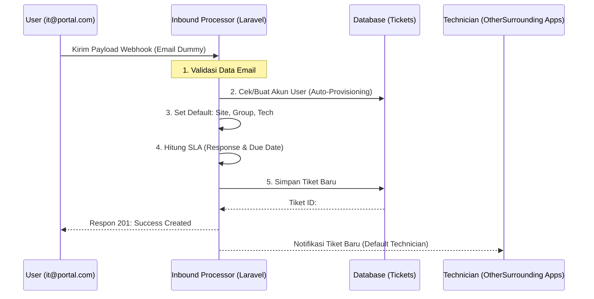

# Panduan Otomatisasi: Email-to-Ticket Flow 🚀

Dokumentasi ini menjelaskan secara mendalam bagaimana sistem ServiceDesk mengolah email masuk menjadi tiket otomatis, lengkap dengan petunjuk simulasi untuk Anda uji coba.

## 1. Alur Visual (Visual Journey)

Berikut adalah perjalanan sebuah data dari email hingga muncul di dashboard Anda:



---

## 2. Detail Teknis (API Specification)

**Endpoint:** `POST /api/inbound-email`  
**Method:** `POST`  
**Format Data:** `JSON`

### Payload Structure (Input)
Anda perlu mengirimkan JSON dengan field berikut untuk mensimulasikan email:

| Field | Tipe | Deskripsi |
| :--- | :--- | :--- |
| `sender_email` | String | Email asli pengirim (Misal: user@perusahaan.com) |
| `sender_name` | String | Nama lengkap pengirim |
| `subject` | String | Judul keluhan/email |
| `body` | String | Detail pesan atau kronologi masalah |

---

## 3. Simulasi Uji Coba (Practical Testing)

Anda dapat menggunakan Terminal (Mac/Linux) atau Postman untuk mencoba fitur ini.

### Opsi A: Menggunakan Terminal (CURL)
Copy-paste perintah ini ke terminal Anda untuk melihat keajaibannya:

```bash
curl -X POST http://localhost:8000/api/inbound-email \
-H "Content-Type: application/json" \
-d '{
  "sender_email": "budi.santoso@client.com",
  "sender_name": "Budi Santoso",
  "subject": "Masalah pada Dashboard Tableau SIMOLA",
  "body": "Saya tidak bisa melihat data bulan April di dashboard SIMOLA, mohon dibantu."
}'
```

### Opsi B: Menggunakan Postman
1. Buat request baru `POST` ke `http://localhost:8000/api/inbound-email`
2. Di tab **Body**, pilih **raw** dan format **JSON**.
3. Masukkan data seperti contoh di atas, lalu klik **Send**.

---

## 4. Logika Otomatis (Business Rules)

Sistem telah dikonfigurasi dengan logika "Enterprise" berikut:

### A. Akun User Otomatis (Auto-Provisioning)
*   Jika email pengirim **belum terdaftar**, sistem akan otomatis membuatkan akun baru dengan Role **'User'**.
*   User tersebut akan mendapat password acak (keamanan backend).

### B. Properti Default (Automatic Assignment)
Tiket yang masuk via email akan memiliki label berikut secara otomatis:
*   **Site**: `MENARA THAMRIN`
*   **Group**: `L1 Group`
*   **Technician**: `OtherSurrounding Apps`
*   **Category**: `Application` (Default)
*   **Status**: `Open`

### C. SLA & Penjadwalan Tanggal
Sesuai permintaan Anda, sistem menghitung durasi waktu secara otomatis:
*   **Created Date**: Waktu saat email diproses.
*   **Response DueBy**: +1 Hari setelah dibuat (SLA Respon).
*   **DueBy Date**: +7 Hari setelah dibuat (SLA Resolusi).

---

## 5. Tips Eksperimen
*   **Coba Email Baru**: Gunakan alamat email yang berbeda-beda dalam `curl` untuk melihat sistem menambah daftar user secara dinamis.
*   **Cek di Dashboard**: Setelah menjalankan perintah di atas, buka menu **Requests** di browser dan Anda akan melihat tiket baru muncul (biasanya di posisi paling atas).

> [!TIP]
> Dokumentasi ini disimpan terpisah di `docs/email_to_ticket_automation.md` agar Anda bisa membacanya kapan saja tanpa tercampur dengan panduan teknis lainnya.
